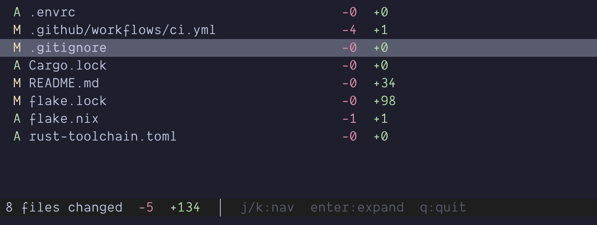

# git-rt

A real-time terminal dashboard for git changes. Watch your working tree update live as you edit files, with inline diffs and configurable actions.


## What it does

Run `git-rt` in a terminal pane alongside your editor. It shows a live-updating view of all changed files with insertion/deletion counts, and lets you expand any file to see its diff inline.



## Install

```bash
cargo install --path .
```

## Usage

```bash
# Run in the current git repository
git-rt

# Run for a specific repo
git-rt /path/to/repo

# Custom debounce interval
git-rt --debounce 500
```

### Default keybindings

| Key           | Action             |
| ------------- | ------------------ |
| `j` / `↓`     | Move down          |
| `k` / `↑`     | Move up            |
| `Enter` / `l` | Expand file diff   |
| `h`           | Collapse file diff |
| `r`           | Refresh            |
| `q`           | Quit               |

## Configuration

Create `~/.config/git-rt/config.toml` to customize behavior:

```toml
debounce_ms = 200

[display]
show_status = true
context_lines = 3

[actions.open_editor]
key = "e"
command = "nvim {file}"

[actions.diff_view]
key = "d"
command = "git diff -- {file} | delta"
```

## Development

### Prerequisites

- [Rust](https://rustup.rs/) (pinned via `rust-toolchain.toml`)
- Or [Nix](https://nixos.org/) + [direnv](https://direnv.net/) for a reproducible dev environment

### With Nix (recommended)

```bash
direnv allow  # one-time setup, auto-activates on cd
cargo run     # run the app
cargo test    # run tests
```

### Without Nix

```bash
rustup show           # installs toolchain from rust-toolchain.toml
cargo run             # run the app
cargo test            # run tests
cargo clippy          # lint
cargo fmt             # format
```

### Nix commands

```bash
nix flake check       # build + clippy + fmt
nix build             # build the package (output in ./result)
nix run               # build and run
nix flake update      # update pinned dependencies
```

## License

MIT
